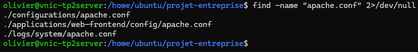
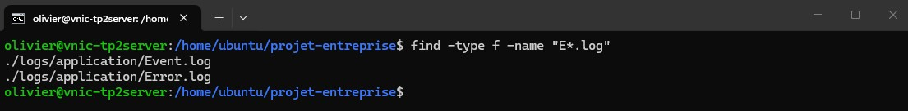
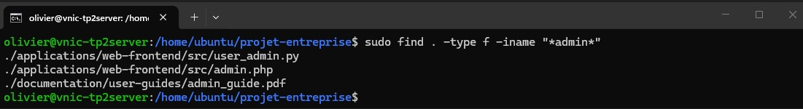
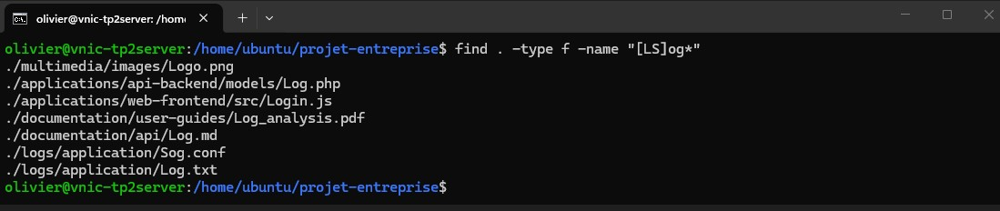
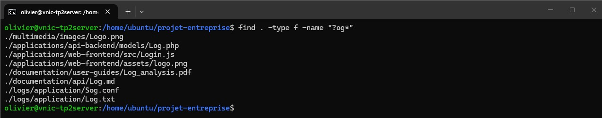
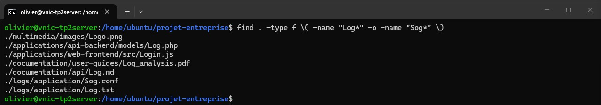
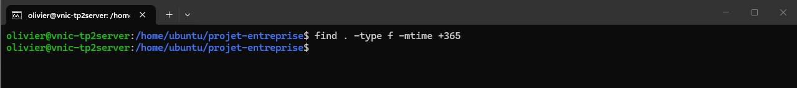
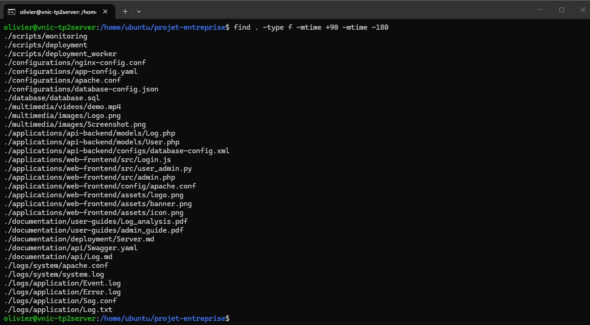
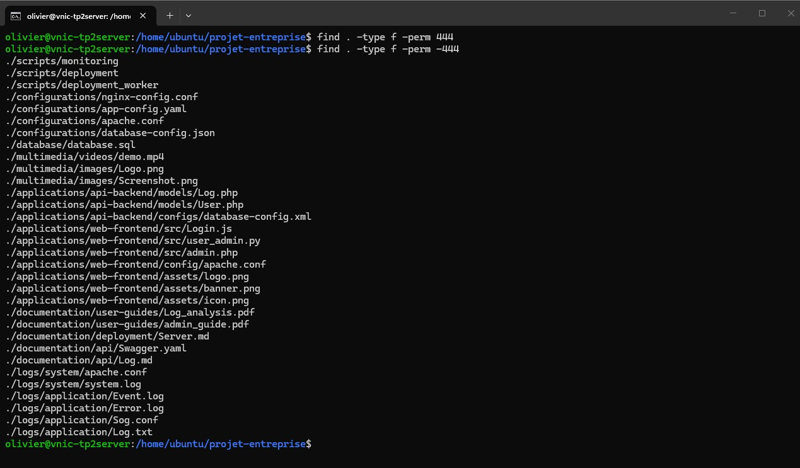
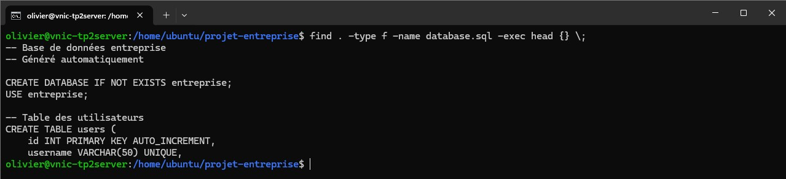

**420-16D-FX**  
**Jean-Sébastien Nadeau**  

# Travail Pratique 2 - Administration système et analyse de données

## Modalités 

- **Pondération :** 15% de la session  
- **Travail individuel**: Vous êtes le seul expert Linux disponible !
- **Matériel fourni** : Archive `projet-entreprise.tar.gz` (à télécharger sur `Léa`) avec exemple pour le fichier de remise.
- **Livrables** : Captures d'écran avec invite de commandes visible + nom d'utilisateur
- **Oracle cloud**: Chacune des opérations(commandes) doivent être fait sur un ordinateur linux distant en utilisant SSH.
- **Points** : Chaque question vaut **1 point** sauf indication contraire

## 📋 Livrables à Remettre
- Doit être une archive contenant un fichier texte qui a un lien HTTP vers l'adresse IP publique de votre serveur distant, votre clé ssh privé pour accèder à votre serveur et un lien vers votre dépôt Git privé sur GitHub. Vous devez m'ajouter comme contributeur en utilisant le nom de profil : `jsteach`. Cette archive sera remise sur **LÉA** avant **23h59 le 23 Mars**.


**Nom :** Lacroix
**Prénom :** Olivier

---

## 📋 Instructions de Remise

- **Créer un dossier** `img/` dans le même répertoire que ce fichier
- **Nommer vos captures** : `1.jpg`, `2.jpg`, `3.jpg`, etc. (selon le numéro de question)
- **Ouvrir ce fichier** avec un visualiseur Markdown pour voir les images automatiquement
- Toutes les questions nécessitent une **capture d'écran** montrant :
  - L'invite de commandes complète avec votre nom d'utilisateur
  - Utilisez un nom d'utilisateur personnalisé identifiable
  - La commande saisie ET son résultat


---


## Consignes

## Mise en situation

Vous êtes administrateur système dans une entreprise de développement logiciel. L'équipe de développement a créé une vaste arborescence de fichiers contenant du code source, de la documentation, des logs et des ressources multimédias pour plusieurs projets.

Votre mission : optimiser la gestion de cette infrastructure en utilisant les outils Linux avancés pour rechercher, analyser et traiter efficacement les données. L'équipe compte sur vous pour automatiser certaines tâches et surveiller les processus système.

## Préparation de l'environnement

Téléchargez et décompressez l'archive `projet-entreprise.tar.gz` qui contient la structure de fichiers pour ce TP. Envoyer cette archive sur votre machine distante avec la commande `scp`.

```bash
# Commande de décompression
tar -xzf projet-entreprise.tar.gz
cd projet-entreprise
```

Vous devriez obtenir une arborescence similaire à :
```
projet-entreprise/
├── applications/
├── configurations/
├── database/
├── documentation/
├── logs/
├── multimedia/
└── scripts/
```

**Point de départ :** Toutes les commandes doivent être exécutées depuis le répertoire racine `projet-entreprise/`.

---

## Section 1 : Recherche de fichiers avec `find` (11 points)

### Contexte
L'équipe de développement vous demande d'analyser la structure des fichiers pour optimiser l'organisation du projet.


**Question 1** - L'équipe cherche tous les fichiers de configuration Apache. Utilisez la commande `find` pour localiser tous les éléments nommés `apache.conf`.

**Capture d'écran :**


**Question 2** - Un développeur a perdu des fichiers de logs commençant par la lettre "E" (comme "Error.log", "Event.log"). Trouvez tous les fichiers commençant 
par "E", en excluant les dossiers.

**Capture d'écran :**


**Question 3** *(2 points)* - L'équipe recherche des images de taille moyenne pour l'interface utilisateur. Trouvez tous les fichiers entre 200 et 260 kilo-octets, 
avec l'extension `.png` et situés à une profondeur maximale de 3 niveaux.

**Capture d'écran :**


**Question 4** - Un audit de sécurité nécessite de trouver tous les fichiers contenant "admin" dans leur nom, sans distinction de casse.

**Capture d'écran :**


**Question 5** - Recherchez tous les fichiers commençant spécifiquement par "L" ou "S" suivi de "og" (comme "Log.txt", "Sog.conf"). Utilisez la notation avec 
crochets `[]`.

**Capture d'écran :**


**Question 6** - Trouvez tous les fichiers commençant par une seule lettre suivie de "og" sans distinction d'extension. Utilisez la notation avec point 
d'interrogation `?`.

**Capture d'écran :**



**Question 7** - Répétez la question 5 mais en utilisant la notation avec OR logique (`-o`).

**Capture d'écran :**



**Question 8** - Pour l'archivage, localisez tous les fichiers modifiés il y a plus d'un an.

**Capture d'écran :**



**Question 9** - Pour la maintenance, trouvez tous les fichiers modifiés entre 3 et 6 mois (environ).

**Capture d'écran :**



**Question 10** - Audit de sécurité : trouvez tous les fichiers ayant uniquement les permissions de lecture pour tous les utilisateurs (444).

**Capture d'écran :**


---

## Section 2 : Commandes avancées avec `find`, `exec` et pipes (13 points)

### Contexte
Vous devez maintenant analyser le contenu des fichiers pour extraire des informations pertinentes pour l'équipe.

**Question 11** - Trouvez le fichier `database.sql` et affichez son contenu avec `exec`. Limitez l'affichage aux premières lignes seulement.

**Capture d'écran :**



**Question 12** - Utilisez `find` avec `exec` pour localiser `database.sql` et afficher ses 5 premières lignes.

**Capture d'écran :**


**Question 13** - Même fichier, mais affichez les 5 dernières lignes.

**Capture d'écran :**


**Question 14** - Affichez le contenu de `database.sql` page par page en utilisant `find` avec `exec`. Vous pouvez montrer seulement la commande.

**Capture d'écran :**


**Question 15** *(2 points)* - En une seule commande, filtrez le contenu de `database.sql` pour afficher uniquement les lignes contenant "SELECT" ou "INSERT", avec numéros de ligne et coloration des termes trouvés.

**Capture d'écran :**


**Question 16** *(2 points)* - Utilisez `tail` et `head` pour afficher uniquement la ligne 500 du fichier `database.sql` et redirigez le résultat vers `extract.txt` en une seule commande.

**Capture d'écran :**


**Question 17** *(3 points)* - Créez une commande qui trie tous les fichiers du projet par nombre de lignes en utilisant `find`, `wc` et `sort`. Assurez-vous que le tri soit correct (numérique).

**Capture d'écran :**


**Question 18** *(0 point)* - Créez un dossier appelé `backup-configs`.

**Capture d'écran :**


**Question 19** *(2 points)* - Utilisez `find` et `cp` pour localiser tous les fichiers contenant "config" dans leur nom (majuscule ou minuscule) et les copier dans `backup-configs`. Tout en une commande. Affichez ensuite le contenu du dossier avec `ls`.

**Capture d'écran :**


---

## Section 3 : Gestion des processus (14 points)

### Contexte
L'équipe a développé des scripts de déploiement qui doivent être surveillés et contrôlés pendant l'exécution.

**Question 20** - Donnez les droits d'exécution au répertoire `scripts/` de manière récursive.

**Capture d'écran :**


**Question 21** - Lancez le script `scripts/deployment` en arrière-plan. Ajoutez le caractère approprié pour l'exécution en arrière-plan.

**Capture d'écran :**


Le script semble avoir des problèmes et vous devez intervenir pour diagnostiquer et résoudre la situation.

**Question 22** - Utilisez la commande `top` pour afficher les processus et trouver le PID de `deployment`. Filtrez pour voir uniquement vos processus utilisateur.

**Capture d'écran :**


**Question 23** - Utilisez `ps` pour afficher les processus et localiser le PID de `deployment`. Ajoutez les paramètres pour voir les noms complets des processus.

**Capture d'écran :**


**Question 24** - Le script a lancé des sous-processus `deployment_worker`. Tentez d'arrêter le processus principal `deployment` avec `kill` sans paramètres supplémentaires. Montrez l'échec avec `ps`.

**Capture d'écran :**


**Question 25** - Affichez la liste des signaux disponibles avec `kill -l`. Ensuite, utilisez la commande `kill -l SIGINT` pour trouver la valeur numérique du signal SIGINT.

**Capture d'écran :**


**Question 26** *(2 points)* - Éliminez tous les processus `deployment_worker` avec `killall` en demandant confirmation pour chaque processus.

**Capture d'écran :**


**Question 27** - Terminez le processus principal `deployment` en utilisant le signal `SIGINT` approprié (utilisez soit le nom SIGINT soit sa valeur numérique). Le script est programmé pour capturer ce signal et se terminer proprement avec un message d'arrêt.

**Capture d'écran :**


**Question 28** - Vérifiez que tous les processus ont été terminés en utilisant `ps` (ils doivent être absents).

**Capture d'écran :**


**Question 29** - Lancez le script `scripts/monitoring` en arrière-plan .

**Capture d'écran :**


**Question 30** - Utilisez `ps` pour afficher le processus `monitoring` et montrer sa priorité actuelle.

**Capture d'écran :**


**Question 31** - Modifiez la priorité du processus `monitoring` en l'augmentant de 10 avec la commande `renice`.

**Capture d'écran :**


**Question 32** - Terminez proprement le processus `monitoring` en utilisant le signal approprié.

**Capture d'écran :**


---

